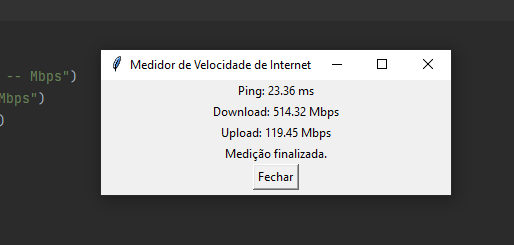

# PySpeedTest



## Overview

PySpeedTest is a command-line utility written in Python that allows you to measure and analyze your internet connection's performance. This tool leverages the popular [Speedtest.net](https://www.speedtest.net) servers to provide accurate and comprehensive insights into your internet connection. Whether you're troubleshooting network issues or simply curious about your internet speeds, PySpeedTest is a valuable tool.

### Features

- **Ping Measurement**: Determine the latency of your internet connection in milliseconds (ms). A lower ping value indicates a more responsive network.

- **Download Speed**: Measure the speed at which data can be downloaded from the internet to your device. This is typically measured in megabits per second (Mbps).

- **Upload Speed**: Measure the speed at which data can be uploaded from your device to the internet. Similar to download speed, it's measured in megabits per second (Mbps).

- **Server Selection**: Choose a specific Speedtest.net server to perform your tests. This allows you to check the performance to a particular location or service provider.

- **Easy-to-Use**: PySpeedTest provides a user-friendly command-line interface, making it accessible to users of all technical levels.

- **Real-Time Updates**: Enjoy real-time speed measurements, so you can see how your connection performs over time.

## Getting Started

### Prerequisites

Before you can use PySpeedTest, you need to have Python installed on your system. You can download Python from the official website: [python.org](https://www.python.org/downloads/).

### Installation

1. Clone this repository to your local machine.

   ```bash
   git clone https://github.com/your-username/your-repository.git
   ```

2. Navigate to the project directory.

   ```bash
   cd PySpeedTest
   ```

3. Install the required Python packages using pip.

   ```bash
   pip install -r requirements.txt
   ```

### Usage

To perform a speed test with PySpeedTest, simply run the following command in your terminal:

```bash
python PySpeedTest.py
```

PySpeedTest will automatically detect your location and find the closest Speedtest.net server for the test. You'll see real-time updates of your ping, download, and upload speeds.

### Options

- Use the `--server` option to specify a particular Speedtest.net server for testing:

  ```bash
  python PySpeedTest.py --server 12345
  ```

- For more options and information, run:

  ```bash
  python PySpeedTest.py --help
  ```

## Contributing

We welcome contributions from the community. If you'd like to contribute to PySpeedTest, please follow our [contribution guidelines](CONTRIBUTING.md).

## License

PySpeedTest is open-source software licensed under the [MIT License](LICENSE).

---

**Note:** PySpeedTest is not affiliated with Speedtest.net or Ookla in any way. It's an independent project created for educational and diagnostic purposes.
```

